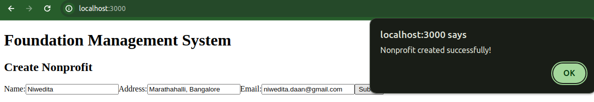
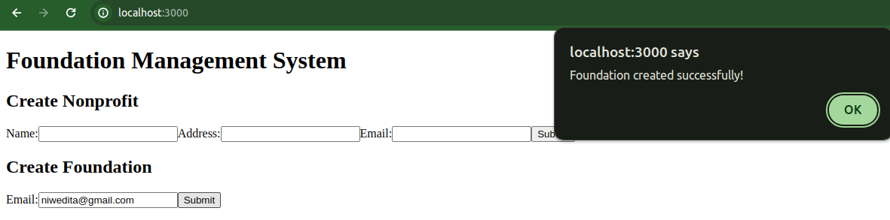
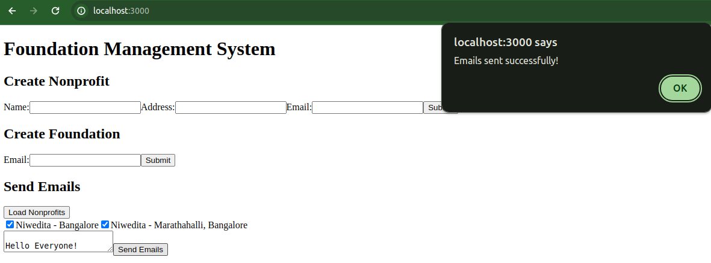
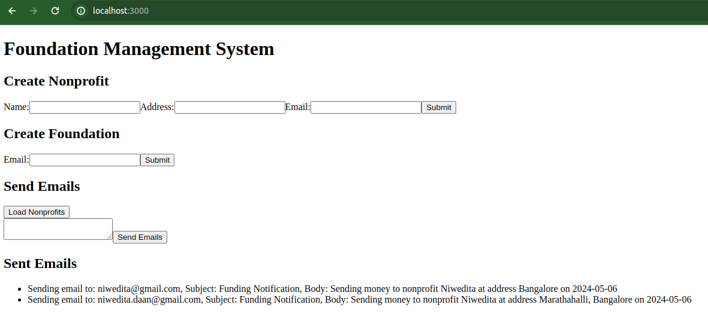

# Foundation Management System
This is a full-stack service for managing nonprofits and sending emails to them.

## Problem

Large foundations tend to distribute money to several hundreds of nonprofits within a year. For legal reasons, the foundation needs to formally email each nonprofit a message that contains the nonprofit's name, the address, and the current date.

As you can imagine, it is tedious for foundations to manually create an email for each nonprofit they distribute money to. We want to help make their process easier by building some UI and API endpoints to manage this workflow.

Task is to create a full-stack application that can do the following:

- Allows someone to create and save nonprofits and their metadata (name, address, and email)
- Allows someone to create and save foundations and their metadata (email)
- Allows someone to send an email to a list of nonprofits with a templated message (i.e. "Sending money to nonprofit { name } at address { address }") and sends the email with the templated fields populated
- Allows someone to view all the emails that have been sent to nonprofits

Assumptions
- Email is a unique identifier for both nonprofits and foundations
- Assume the data passed into the API endpoints will be valid (i.e. you don't need to check for bad request data)

## Project
### Frontend Structure:
#### Components:
- NonprofitForm: Form component for creating new nonprofits.
- FoundationForm: Form component for adding new foundations.
- EmailSender: Component for composing and sending emails to nonprofits.
- SentEmails: Component for displaying a list of sent emails.
#### App Component:
- The main component that composes the application.
- Renders the NonprofitForm, FoundationForm, EmailSender, and SentEmails components.
#### Dependencies:
- Uses npm for package management.
- Utilize additional dependencies such as React Router for routing, Axios for making HTTP requests, and any UI libraries/frameworks for styling.

### Backend Structure:
#### Controllers:
- EmailController: Handles requests related to sending emails to nonprofits.
- NonprofitController: Handles requests related to managing nonprofits.
- FoundationController: Handles requests related to managing foundations.
#### Services:
- EmailService: Service responsible for sending emails.
- NonprofitService: Service responsible for managing nonprofits.
- FoundationService: Service responsible for managing foundations.
#### Entity:
- Nonprofit: Model representing a nonprofit entity.
- Foundation: Model representing a foundation entity.
#### Dependencies:
- Utilizes Spring Boot for backend development.
- Utilize additional dependencies such as Spring Data JPA for database access, Spring Web for RESTful APIs, and any libraries for email sending functionality.

```bash
foundation-management-system/
├── backend/              
│   ├── src/
│   │   ├── main/
│   │   │   ├── java/
│   │   │   │   ├── com.example.foundationmanagement/
│   │   │   │   │   ├── controller/          
│   │   │   │   │   │   ├── EmailController.java
│   │   │   │   │   │   ├── FoundationController.java
│   │   │   │   │   │   └── NonprofitController.java
│   │   │   │   │   ├── entity/             
│   │   │   │   │   │   ├── Foundation.java
│   │   │   │   │   │   └── Nonprofit.java
│   │   │   │   │   ├── repository/         
│   │   │   │   │   │   ├── FoundationRepository.java
│   │   │   │   │   │   └── NonprofitRepository.java
│   │   │   │   │   └── service/            
│   │   │   │   │       ├── EmailService.java
│   │   │   │   │       ├── FoundationService.java
│   │   │   │   │       └── NonprofitService.java
│   │   │   │   └── FoundationManagementApplication.java
│   │   │   └── resources/
│   │   │       └── application.properties   
│   │   │       
├── frontend/             
│   ├── components/
│   │   ├── NonprofitForm.js
│   │   ├── FoundationForm.js
│   │   ├── EmailSender.js
│   │   └── SentEmails.js
│   ├── pages/
│   │   └── index.js       
│   ├── public/
│   │   ├── favicon.ico
│   │	└── index.html
│   ├── styles/
│   │   ├── global.css
│   │	└── components/
│   │		├── NonprofitForm.module.css
│   │		├── FoundationForm.module.css
│   │		├── EmailSender.module.css
│   │		└── SentEmails.module.css
│   └── package.json      
│   
└── build.gradle            
```

## Steps to run the application

1. Clone the repository:
```bash
git clone https://github.com/Niwedita17/foundation-management-system.git
```
2. Install dependencies for the frontend:
```bash
cd foundation-management-system/frontend
npm install
```

3. start the mysql server
```bash
sudo systemctl start mysqld
```

3. Run the build from com.example.foundationmanagement.FoundationManagementApplication.java for backend

4. Run frontend
```bash
nvm run dev
```

5. Access the application in your browser: http://localhost:3000

## Screenshots of the run

### Create NonProfit



### Create Foundation



### Send Email to the nonProfits



### Sent EMail

